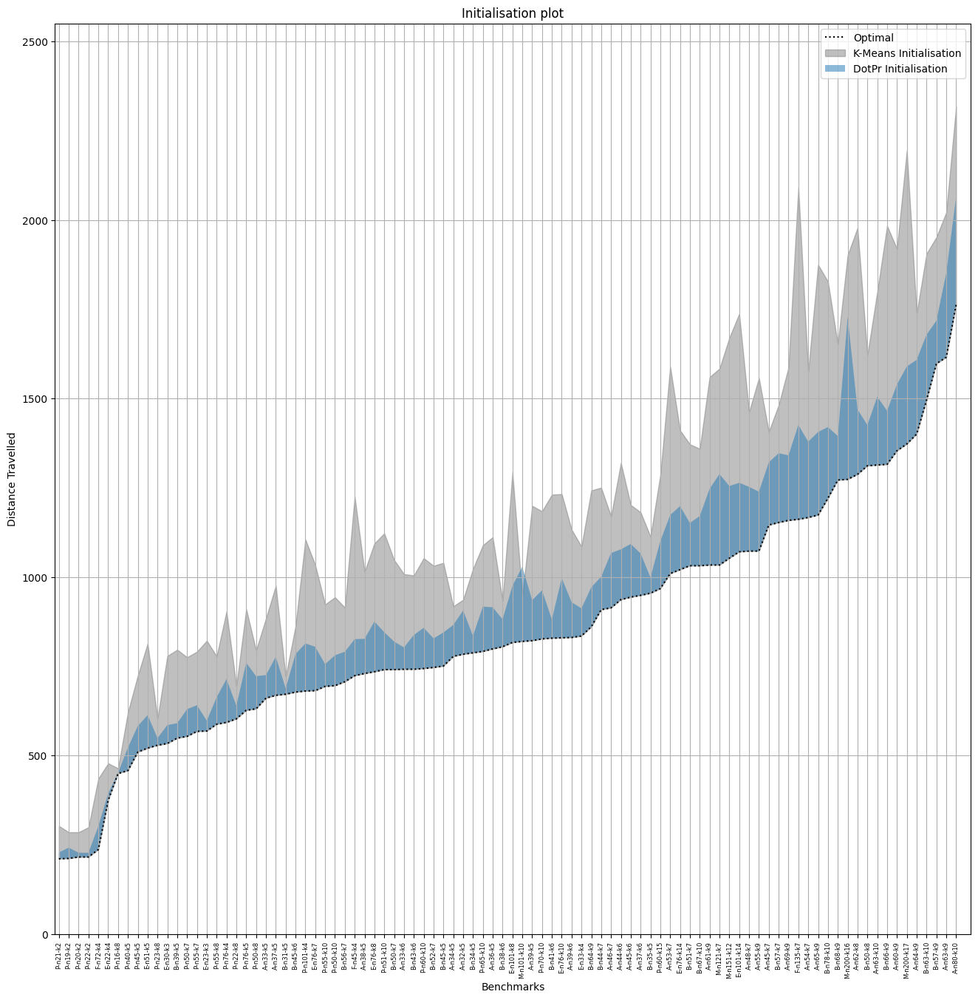

# Fast Genetic Algorithm for Green Vehicle Routing Problem
[](https://www.swift.org)

A fast converging Genetic Algorithm, for Green Vehicle Routing Problem by introducing Corridor Model from Evolutionary Strategies, written completely in Swift.

## Thinking Behind Algorithm
Inspired by the Corridor Model from Evolutionary Strategies, we introduce an analogue using Dot Product and Probabilitstic Roulette Selector to help drastically improve the inter-generation convergence speed. Instead of focusing on "What mutator do I use?" we focused on "How the mutator mutate?" and using the locality of customers to serve, we approximate optimal mutations for faster convergence. 

We also introduced a more optimal initialisation algorithm to further speed up the convergence. The fast convergence allows the algorithm to:

*  Spend the remaining iteration on optimising for other objectives.
*  Provide a good initial population for other multi-objective optimisation VRP problems.

The repository has $3$ distinct branchs, each representing approaches of solving VRP:

1. main -> Tumble Weed Model: the best performing model.
2. StrictnessLearningArchitecture -> A self adaptation model that tries to find optimal `strictness` values, used to determine locality size. Sligtly slower than tumble weed model, due to unknown optimal strictness value, but upon finding it, gets much faster convergence.
3. InfinitelyWideCorridorModel -> TumbleWeedModel but max strictness set to $0$, giving complete randomness, refered to in paper as `No Adaptation Model`.

More details will be provided here in form of a research paper, which provides detailed motivation, overview and future work of the algorithm in great details. A macOS app will also be made available to help visualise the main contributions of this research.

## Results
Find below the results obtained by the algorithm, starting with the 
initialisation results:


The convergence speed comparison of Tumble Weed Model vs No Adaptation


The final distance result after running $(100 + 100)$ genetic algorithm for $500$ iterations with the range obtained after testing it for $10$ runs:


The final fuel results of the above test benchmark, and the range of results range obtained after testing it for $10$ runs:


## How to use
For Xcode user, simple open the Xcode build the project, and copy the `Benchmarks` folders into the same directory where the built target is created. Then use:

 `./<Executable Name> contains <Benchmark Substring>` for running certain subsets of the benchmarks that contains the substring : eg `./Experiment\ 6 contains A-n32-k5`. 

Similary one can also run it on all the benchmark including and after the `./<Executable Name> after <Benchmark Name>`, eg `./Experiment 6 after M-n200-k17`.

For all other platforms, in the root folder of the repository `swiftc -o <Output File Name> <List of all *.swift files in directory>`, then simply `./<Output File Name>`.

The algorithm will return files `<Benchmark Namme>.json`, which is the benchmark repsresentation. `convergence (*).json` contains the time series of distance and fuel evaluation with the $length = iterationCount + 1$, the extra on it the initialisation evaluation. `front (*).json` contains the pareto front of the Distance vs Fuel evaluation. In the aforementioned file `*` denotes the run number the range of which can be change in `main.swift`. The defination of Benchmark files is:
```
struct EncodedBenchmark : Codable {
    let benchmark : String
    let customers : [EncodedCustomer]
    let fleetSize : Int
    let vehicleCapcity : Int
    let optimal : Int?
}
```
where EncodedCustomer is:
```
struct EncodedCustomer : Codable {
    let id : Int
    let x : Double
    let y : Double
    let demand : Int
}
```
convergence:
 
 ```
 struct Convergence : Encodable {
    let benchmark : String
    let optimalDistance : Int?
    let distanceSequence : [Double]
    let fuelSequence : [Double]
}
 ```

pareto front:
```
struct SaveData : Encodable {
    let benchmark : String
    let Optimal : Int?
    let front : [EncodableRoutine]
}
```
one can use the json format to run their own custom benchmark. The depot is marked by setting `demand = 0` and it is 1 depot problem solver, so only one customer can have `demand = 0`.

---
